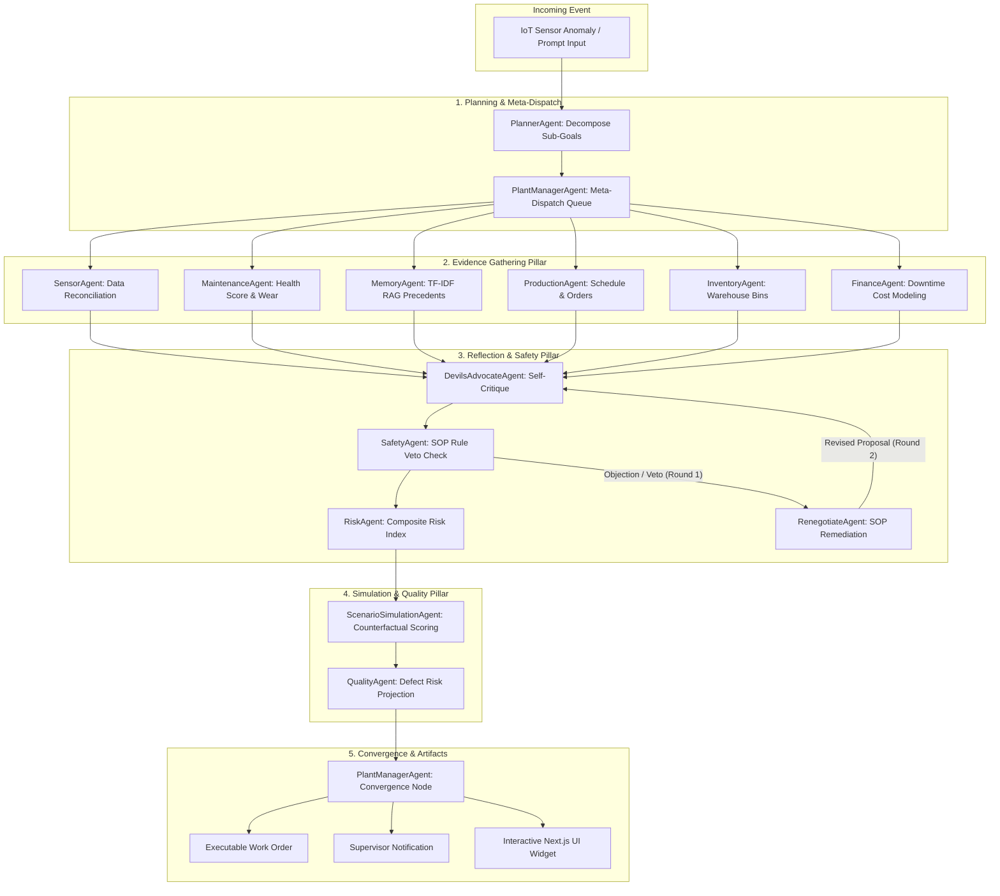

# 🏭 AGENT NEXUS: INDUSTRY 4.0 AUTONOMOUS DECISION TWIN
### *An Agentic AI Operating System for Manufacturing & Predictive Maintenance*

[](https://nitrostack.ai)
[](https://modelcontextprotocol.io)
[](https://app.nitrocloud.ai)
[](https://www.typescriptlang.org/)
[](LICENSE)

---

## 📌 Executive Summary

**Agent Nexus (Decision Twin)** models how a smart manufacturing plant makes real-time, high-stakes operational decisions under uncertainty. When hardware anomalies occur (e.g. spindle bearing wear, vibration spikes, thermal runaway), **Agent Nexus** dynamically coordinates a team of **12 specialized AI sub-agents** across 5 decision pillars:

1. **Planning & Meta-Dispatch**: Dynamic event decomposition & phase-based queue orchestration.
2. **Evidence Gathering**: Autonomous MCP tool execution, live telemetry validation, TF-IDF RAG precedent retrieval, inventory bin checks, & financial downtime modeling ($50k repair-now vs $192k delay-risk).
3. **Reflection & Safety**: Round-1 self-critique challenge loop, **SOP Safety Rule Vetoes** (`SOP-RULE-14`), composite risk scoring, and Round-2 proposal renegotiation.
4. **Data-Source Priority Policy & Conflict Resolution**: Explicit priority reconciliation between user-provided prompt telemetry and live sensor baseline feeds with 100% transparency.
5. **Simulation & Execution**: Counterfactual action scoring (`immediate_repair`, `delay_repair`, `reduced_capacity`), downstream quality defect projection, and executable Work Order generation.

---

## 🚨 Problem Statement

In modern Industry 4.0 manufacturing plants, high-stakes operational machinery (such as 5-Axis CNC Mills and Heavy Hydraulic Presses) experiences unplanned hardware anomalies—including spindle bearing wear, vibration spikes, and thermal runaway. 

When an anomaly occurs, plant operators face a critical financial and operational dilemma:
1. **Immediate Repair Shutdown**: Halts production lines immediately, costing **$50,000+ per hour** in lost throughput and idle labor.
2. **Delayed Maintenance**: Risks catastrophic bearing lockup or spindle destruction, resulting in **$400,000+** in equipment replacement, delivery penalties, and safety hazards.

**Traditional static systems fail** because they rely on fixed, hardcoded thresholds or isolated single-agent rules that ignore real-time inventory bin stock, historical precedent, safety SOP vetoes, schedule deadlines, and telemetry source conflicts. 

**Agent Nexus (Decision Twin)** solves this by orchestrating a 12-agent autonomous consensus operating system that dynamically evaluates live telemetry, balances risk vs cost, resolves data-source conflicts, enforces mandatory safety vetoes, and generates executable maintenance work orders.

---

## 🌐 Live Cloud Infrastructure & MCP Endpoint

- **Production Cloud Endpoint**: `https://agent-nexus-6a6560aa-metamindz-amrita-university-coimbatore.app.nitrocloud.ai/mcp`
- **MCP Protocol Version**: `2025-06-18` (Streamable HTTP at `/mcp`, Legacy SSE at `/sse`)
- **Primary GitHub Repository**: [`https://github.com/vishnu-murukan/Agenticai_metamindz`](https://github.com/vishnu-murukan/Agenticai_metamindz)
- **Technical Proposal PDF**: [`Agent_Nexus_Technical_Proposal.pdf`](Agent_Nexus_Technical_Proposal.pdf)

---

## 🏗️ System Architecture & Multi-Agent Consensus Flow



---

## ⚖️ Data-Source Priority Policy Engine

When user prompts contain explicit telemetry (e.g. `Temp: 96°C`, `Vibration: 9.0 mm/s`, `Bearing Wear: 94%`, `Inventory: 8 bearings`) that conflict with live/mock sensor baselines (e.g. `Temp: 88.5°C`, `Vibration: 8.4 mm/s`, `Bearing Wear: 45%`, `Inventory: 3` ERP stock), **Agent Nexus** applies an explicit, non-silent Data Source Priority Engine:

### ⚙️ Priority Policies
1. **`user_input` (Demo Mode - Default)**: Prioritizes user prompt inputs over live defaults for interactive judge testing.
2. **`live_sensor` (Production Mode)**: Prioritizes live IoT sensor telemetry over prompt text.
3. **`merge` (Conservative Strategy)**: Selects worst-case metric bounds.

### 📋 Conflict Audit Log Format
Every conflict resolution is logged with full transparency in the decision output and trace:
```json
{
  "field": "temperature",
  "user_value": 96,
  "live_sensor_value": 88.5,
  "selected_source": "user_input",
  "selected_value": 96,
  "reason": "Configured data-source policy is user_input (Demo Mode). Prioritizing user-provided telemetry (96°C) over live sensor baseline (88.5°C)."
}
```

---

## 🛠️ MCP Tools & Capabilities Registry

All MCP elements are implemented using official `@nitrostack/core` decorators with type-safe Zod schema validation:

| MCP Feature | Decorator / File | Description |
| :--- | :--- | :--- |
| **`run_decision_twin_orchestrator`** | `@Tool()` in [`decision-twin.tools.ts`](src/modules/decision-twin/decision-twin.tools.ts) | Executes full 12-agent Decision Twin consensus loop with configurable `data_source_priority`. |
| **`run_decision_cycle`** | `@Tool()` in [`decision-twin.tools.ts`](src/modules/decision-twin/decision-twin.tools.ts) | Runs negotiation cycle for raw manufacturing event objects. |
| **`get_sensor_data`** | `@Tool()` in [`decision-twin.tools.ts`](src/modules/decision-twin/decision-twin.tools.ts) | Fetches real-time sensor streams and anomaly indicators. |
| **`check_machine_health`** | `@Tool()` in [`decision-twin.tools.ts`](src/modules/decision-twin/decision-twin.tools.ts) | Retrieves maintenance history, component wear breakdown, and health scores. |
| **`check_inventory`** | `@Tool()` in [`decision-twin.tools.ts`](src/modules/decision-twin/decision-twin.tools.ts) | Queries warehouse bin locations (`Warehouse B - Bin 14-C`), stock counts, and lead times. |
| **`estimate_downtime_cost`** | `@Tool()` in [`decision-twin.tools.ts`](src/modules/decision-twin/decision-twin.tools.ts) | Calculates lost revenue, idle labor, and delay penalty financial impacts. |
| **`calculate_risk`** | `@Tool()` in [`decision-twin.tools.ts`](src/modules/decision-twin/decision-twin.tools.ts) | Evaluates composite operational risk and SOP veto conditions. |
| **`generate_work_order`** | `@Tool()` in [`decision-twin.tools.ts`](src/modules/decision-twin/decision-twin.tools.ts) | Generates executable work orders assigned to senior specialists. |
| **`search_incident_history`** | `@Tool()` in [`decision-twin.tools.ts`](src/modules/decision-twin/decision-twin.tools.ts) | Performs TF-IDF RAG retrieval search over historical incident reports. |
| **`simulate_scenario`** | `@Tool()` in [`decision-twin.tools.ts`](src/modules/decision-twin/decision-twin.tools.ts) | Counterfactual scenario simulation for strategy options. |
| **UI Widget (`decision-twin-result`)** | `@Widget('decision-twin-result')` | Next.js glassmorphic 5-tab control dashboard (`ui://widget/next-decision-twin-result.html`). |
| **Plant Resources** | `@Resource()` in [`decision-twin.resources.ts`](src/modules/decision-twin/decision-twin.resources.ts) | Exposes `manufacturing://plant/sensor-overview` and `manufacturing://sop/safety-rules`. |
| **Anomaly Prompt** | `@Prompt()` in [`decision-twin.prompts.ts`](src/modules/decision-twin/decision-twin.prompts.ts) | Exposes `investigate_anomaly` system prompt template. |

---

## 🎨 Interactive Next.js Glassmorphic UI Control Dashboard (`@Widget`)

Decision Twin includes a custom Next.js dark-mode control dashboard rendered inside **NitroStack Studio** and Claude Desktop:

- 📊 **Overview & Telemetry Tab**: Real-time gauge cards for Vibration ($14.2\text{ mm/s}$), Bearing Temp ($108.5^\circ\text{C}$), Health Score ($10\%$), and Hydraulic Pressure.
- 🤖 **12-Agent Matrix Tab**: Interactive graph mapping all 12 sub-agents, their tools, and evidence outputs.
- 🛡️ **Safety & Dissent Tab**: Full audit log tracking Round-1 Devil's Advocate Challenges and Round-2 Safety SOP approvals.
- 🔮 **Counterfactual AI Tab**: Interactive strategy comparison charts ($92\%$ Immediate Repair vs $12\%$ Delay).
- 🖥️ **Live Execution Trace Console**: Expandable step-by-step reasoning transcript.

---

## ⚙️ Quick Start & Local Execution Guide

```bash
# 1. Install dependencies
npm install

# 2. Build production bundle (TypeScript + Next.js Widgets)
npm run build

# 3. Test Data-Source Priority & Conflict Reconciliation Engine
npx tsx test-reconciliation.ts

# 4. Verify Nominal vs Critical Dynamic Orchestrator Execution
npx tsx test-dynamic.ts

# 5. Pack optimized deployment bundle (decision-twin.zip)
npx nitrostack-cli pack

# 6. Start local NitroStack MCP server
npm start
```

---

## 📂 Project Repository Structure

```text
.
├── nitro.config.json                   # NitroStack CLI pure HTTP configuration
├── nitro.config.ts                     # TypeScript NitroStack CLI entry configuration
├── package.json                        # Dependencies (@nitrostack/core, zod, vitest)
├── Agent_Nexus_Technical_Proposal.pdf  # Executive Pitch Proposal & System Architecture
├── src/
│   ├── app.module.ts                   # Root NitroStack application module (@McpApp)
│   ├── index.ts                        # MCP server entry point (0.0.0.0:3000 host binding)
│   ├── reflection_memory/              # RAG Memory, Devil's Advocate & Safety modules
│   ├── modules/
│   │   └── decision-twin/
│   │       ├── decision-twin.data.ts           # Industry 4.0 Digital Twin database
│   │       ├── decision-twin.module.ts         # Decision Twin NitroStack module
│   │       ├── decision-twin.orchestrator.ts    # Multi-agent state machine orchestrator
│   │       ├── decision-twin.planner.ts         # PlannerAgent (Goal decomposition)
│   │       ├── decision-twin.plant-manager.ts   # PlantManagerAgent (Dispatch & convergence)
│   │       ├── decision-twin.sub-agents.ts      # 11 Evidence, Reflection & Simulation sub-agents
│   │       ├── decision-twin.tools.ts         # NitroStack @Tool definitions & Zod schemas
│   │       ├── decision-twin.resources.ts     # NitroStack @Resource definitions
│   │       └── decision-twin.prompts.ts       # NitroStack @Prompt definitions
│   └── widgets/                            # Next.js UI Control Dashboard (@Widget)
│       └── app/decision-twin-result/page.tsx # 5-Tab glassmorphic dashboard
├── test-reconciliation.ts              # Data-Source priority & conflict test runner
└── test-dynamic.ts                     # Nominal vs Critical dynamic validation runner
```

---

## 🏆 Hackathon Compliance & Review Verification

- [x] **100% Type-Safe TypeScript**: Built with official **NitroStack TypeScript SDK (`@nitrostack/core`)**.
- [x] **MCP Protocol 2025-06-18 Compliant**: Native Streamable HTTP (`/mcp`) & Legacy SSE (`/sse`).
- [x] **Interactive UI Widget**: 5-tab glassmorphic dashboard auto-registered over `@Widget`.
- [x] **Multi-Agent Negotiation**: 12 specialized agents, 5 pillars, self-critique challenge loops, and SOP safety vetoes.
- [x] **Data-Source Priority Engine**: Configurable `user_input` / `live_sensor` / `merge` policies with full conflict transparency.
- [x] **Empirically Differentiated Outputs**: Verified opposite outcomes between nominal (`continue_normal_operation`, 95% conf, $50k cost) and critical (`immediate_repair`, 85% conf, $192k cost) runs.
- [x] **NitroCloud Container Ready**: Non-pruned CLI binaries, `0.0.0.0` ingress binding, and instant container boot.

---

### 🌐 Live Endpoint: `https://agent-nexus-6a6560aa-metamindz-amrita-university-coimbatore.app.nitrocloud.ai/mcp`
